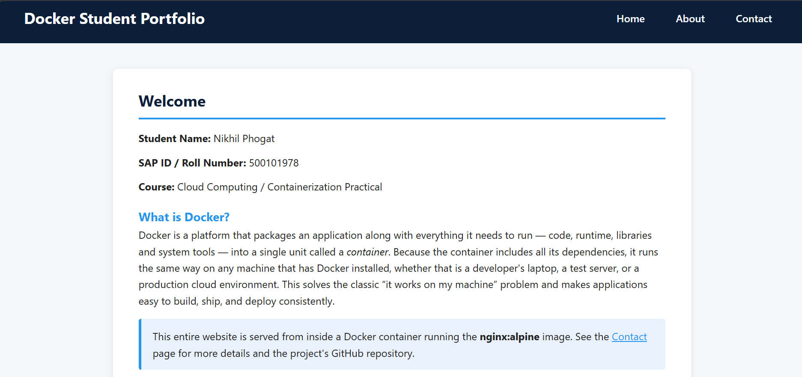

# Docker Static Website Assignment

**Student Name:** Nikhil Phogat
**SAP ID / Roll Number:** 500101978
**Course:** Cloud Computing / Containerization Practical
**Assignment:** Docker Practical 2 — Static Website in a Container

---

## 1. Project Objective

The objective of this assignment is to build a simple 3-page static website,
containerize it using Docker with an `nginx:alpine` base image, and demonstrate
building, running, and inspecting the container end-to-end.

---

## 2. Folder Structure

```
docker-static-website-500101978/
|-- Dockerfile
|-- README.md
|-- website/
|   |-- index.html
|   |-- about.html
|   |-- contact.html
|   `-- style.css
`-- screenshots/
    |-- 01-docker-build.png
    |-- 02-container-running.png
    |-- 03-home-page.png
    `-- 04-docker-inspect.png
```

---

## 3. Dockerfile

```dockerfile
FROM nginx:alpine

LABEL student="Nikhil Phogat"
LABEL roll_number="500101978"
LABEL assignment="Docker Static Website"

COPY website/ /usr/share/nginx/html/

EXPOSE 80
```

### Dockerfile Explanation (Question 2)

**1. Why was `nginx:alpine` selected?**
`nginx:alpine` is a very small (~40 MB), fast, and secure base image because it is
built on Alpine Linux rather than a full OS distribution. Nginx is a
production-grade, high-performance web server that is ideal for serving static
HTML/CSS content, and the Alpine variant keeps the final image lightweight and
quick to build/pull.

**2. What does `COPY` do?**
`COPY website/ /usr/share/nginx/html/` copies the contents of the local
`website/` folder (on the host machine, at build time) into the
`/usr/share/nginx/html/` directory inside the image — this is Nginx's default
directory for serving static web files.

**3. What is the purpose of `EXPOSE 80`?**
`EXPOSE 80` documents that the container listens on port 80 at runtime. It acts
as documentation/metadata for anyone reading the Dockerfile or inspecting the
image; it does **not** by itself publish the port to the host — that is done
separately with the `-p` flag when running the container.

**4. What is the difference between host port 8080 and container port 80?**
Container port 80 is the port Nginx listens on *inside* the isolated container
network namespace. Host port 8080 is the port opened on the actual machine
running Docker. The flag `-p 8080:80` creates a mapping so that any traffic
sent to `http://localhost:8080` on the host is forwarded to port 80 inside the
container. The two ports are independent — the container itself is unaware of
the host-side number.

---

## 4. Build & Run Commands (Question 3)

```bash
# Check Docker installation
docker --version

# Build the image from the Dockerfile in the current directory
docker build -t docker-static-website:1.0 .

# List local images to confirm the build
docker images

# Run a container from the image in detached mode, mapping host 8080 -> container 80
docker run -d --name student-website -p 8080:80 docker-static-website:1.0

# List running containers
docker ps

# View the container's logs
docker logs student-website

# Inspect full container configuration (network, mounts, labels, etc.)
docker inspect student-website

# List the files copied into the container's web root
docker exec student-website ls /usr/share/nginx/html

# Stop the container
docker stop student-website

# Start it again
docker start student-website
```

Then open **http://localhost:8080** in a browser and click through Home → About
→ Contact to confirm all three pages load correctly.

### Command Explanations

**1. Meaning of `-d`**
Runs the container in **detached mode** — in the background — so it doesn't
occupy the terminal and keeps running after the command returns.

**2. Purpose of `--name student-website`**
Assigns a human-readable, fixed name (`student-website`) to the container
instead of a random Docker-generated name, making it easier to reference in
later commands (`docker logs student-website`, `docker stop student-website`,
etc.).

**3. Meaning of `-p 8080:80`**
Publishes/maps host port `8080` to container port `80`, so requests to
`localhost:8080` on the host machine are routed into the container's Nginx
server on port 80.

**4. What `docker ps` displays**
Lists all currently **running** containers, showing their container ID, image,
command, creation time, status, exposed/mapped ports, and name. (`docker ps -a`
would show stopped containers too.)

**5. What `docker inspect` is used for**
Returns a detailed, low-level JSON description of a container (or image) —
including its network settings, mounted volumes, environment variables,
labels, restart policy, and current state — useful for debugging and
verification.

---

## 5. Website Content Summary

- **index.html** — Title "Docker Student Portfolio", student details, course
  name, a short explanation of Docker, and navigation links to About/Contact.
- **about.html** — Six Docker concepts (Image, Container, Dockerfile, Port
  Mapping, Registry, Layers/Caching), each explained in 1–2 sentences.
- **contact.html** — Student name, institutional email, GitHub repository
  link, and a statement confirming the site runs inside a Docker container.
- **style.css** — Shared, consistent styling (navigation bar, headings, info
  boxes) applied across all three pages.

---

## 6. Screenshots

> Replace these with your own screenshots after running the commands above.


*`docker build` completing successfully.*


*`docker ps` showing the running `student-website` container.*


*Website home page open at http://localhost:8080.*


*`docker inspect student-website` output.*

---

## 7. GitHub Repository

🔗 **Repository URL:** https://github.com/Nikhil-Phogat/Assignment.git

---

## 8. Submission Checklist

- [x] Three website pages and CSS file completed
- [x] Dockerfile completed
- [ ] Image builds successfully *(verify locally)*
- [ ] Container runs at http://localhost:8080 *(verify locally)*
- [ ] Four screenshots included *(add your own)*
- [x] README.md completed
- [x] GitHub link included
- [ ] README saved as PDF (`Docker_Practical_2_500101978.pdf`)